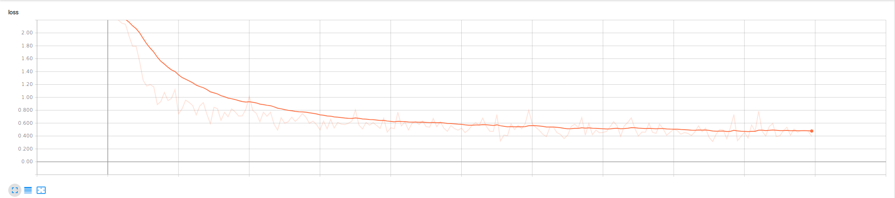

# Fashion MNIST with Tensorflow

**Shah Zafrani -- Machine Learning CS7627 -- Spring 2018**

For this assignment I have chosen to use TensorFlow (v1.5) to implement a Convolutional Neural Network on the MNIST dataset. I followed a tutorial on the TensorFlow documentation website to create a CNN with 2 convolutional layers and 2 pooling layers. The structure is as follows: Input --> Conv Layer w/ 32 filters and RELU activation --> MAX pool layer [2,2], stride 2 --> Conv layer w/ 64 filters and RELU activation --> Max pool layer [2,2], stride 2 --> dense layer w/ flattening --> logits layers --> softmax output.

It took a long time to run so I used Floydhub as a cloud computing environment. 

After completing the tutorial and getting 97% accuracy, I decided to apply the architecture to the Fashion MNIST dataset which has been proposed as a replacement to the standard handwritten digit MNIST dataset. The Fashion MNIST dataset is a similar 10 class classification problem but is much more difficult. This architecture without modification was only able to achieve 83% accuracy.  

In the future I will continue to experiment with different combinations of convolutional and pooling layers. 

Convergence (shown with Tensorboard): 

## References

Dataset from: https://github.com/zalandoresearch/fashion-mnist

Code from tutorial at: https://www.tensorflow.org/tutorials/layers

Cloud execution environment: https://floydhub.com
